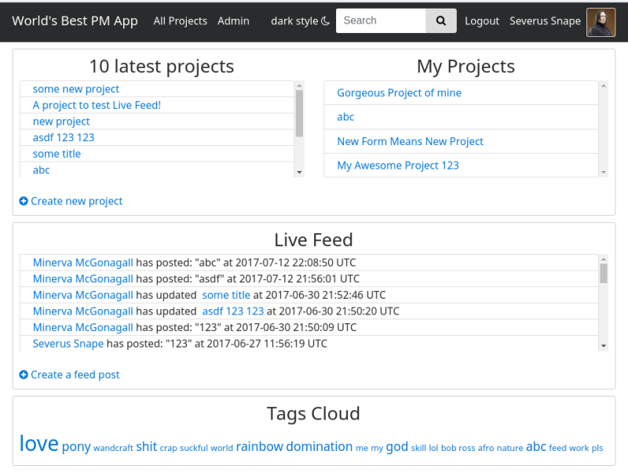
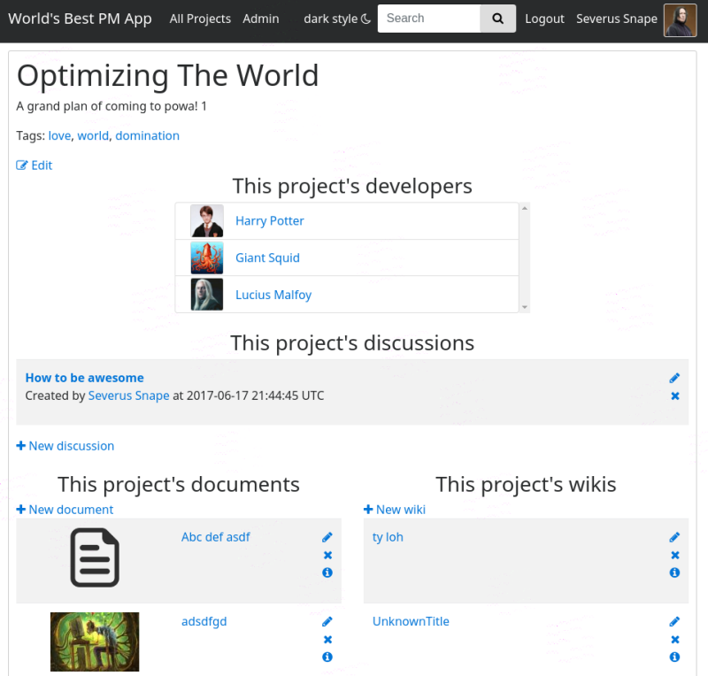
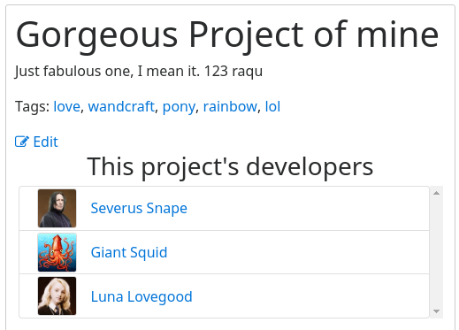
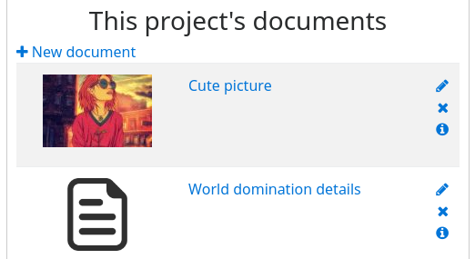
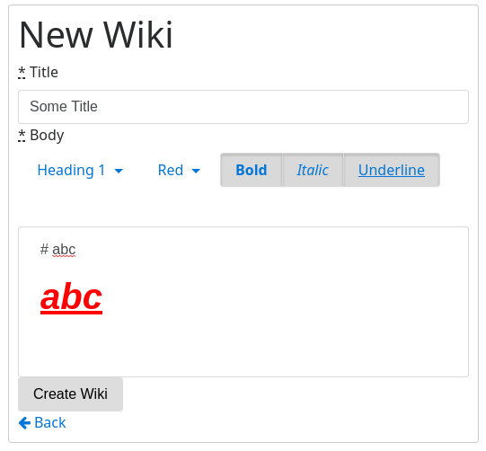
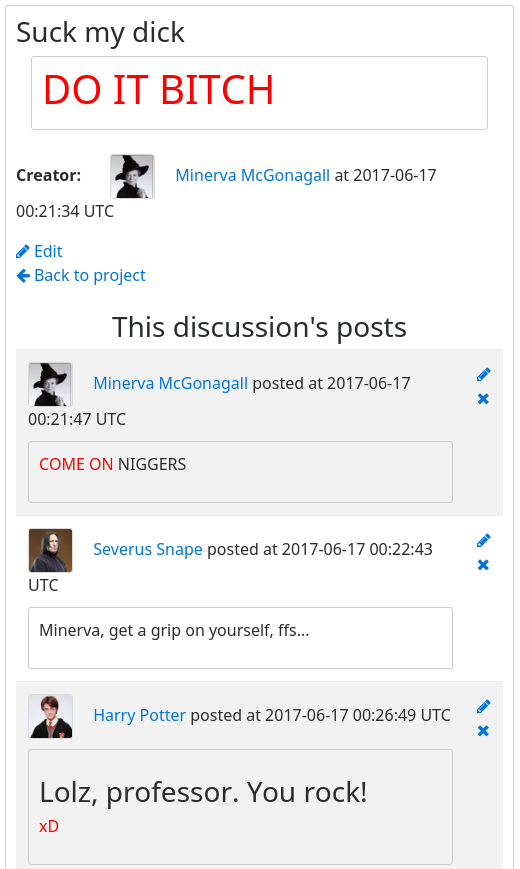
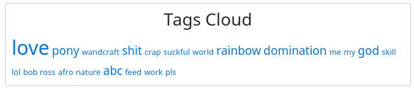

# Project Management App

This app enables managers and developers to peacefully coexist, whilst still working together on various projects in a
single app - with files in a cloud, wiki pages on markdown, and, of course, discussions (nothing, but a little drama). 
Auto-updates and proper authorizations included.

## Technology overview

This app is built with ruby 2.4.1, rails 5.0.3 and utilizes Bootstrap 4 with FontAwesome icons for the web pages. 
The layout is *almost* fully compatible with any screen size. Ajax and ActionCable are used for seamless changes on the
pages, with a bit of CoffeeScript and jQuery applied to it. MySQL stands for database.
 
Some of the gems that were used:

- **devise** for user profiles
- **cancancan** for authorizations
- **acts-as-taggable-on** for tags
- **thinking-sphinx** for full-text search
- **cloudinary** for files cloud
- **redcarpet** for markdown rendering

and many more!

## Looks overview

Main page from an admin's perspective:

##

Project's page from an admin's perspective:

## Features

### TO DO

- i18n for another language
- make a separate page for feeds, that auto-updates and loads older feed posts as you scroll down
- swap bootstrap lists with something more flexible (looks bad on small screens, when there is too much content inside 
of an element)
- revamp ActionCable code
- restrict documents (files) access to the respective project's users only
- add freeze/unfreeze events broadcast to feeds
- fix last editor not being shown after some fixes...

### User roles

There are three groups of users: **admins**, **managers** and **developers**. Every user's a developer upon sign up.
An admin assigns users' roles via the admin panel.

- **Admin**'s a God. Nuf' said. Motto: "I am the Alpha and the Omega".

- **Manager** is someone who manages projects, obviously. They can do almost anything, except changing other users' 
info. Motto: "Work, you monkeys, the sun is still high!"

- **Developers** are the people who do the actual job, but have no rights except to work on a ~~cage~~ project they've
 been assigned to. Motto: "I live only to serve... I humbly obey..."
 
Every user has the projects they've been assigned to shown in their profile.

### Projects

A project consists of a title, a description, tags, and some sets of wiki pages, documents in the cloud, and 
discussions. It also has specific developers assigned to it by the managers. Those developers would have full access to
 the project. All the wikis, documents and discussions have creator/last updater info as dropdown lists. A manager can
 also freeze a project, so that no changes can be made to it, unless unfrozen.

### Files cloud
 
Cloudinary service is used to store documents in a safe and consistent way. Any user can load a file to the cloud by
using the GUI and access it freely.

 
### Wiki pages

Wiki pages are simply some info pages that support markdown and has WYSIWYG for handy text processing.

### Discussions

Discussions consist of posts that users left in them. Sort of like forum threads. There is no need to refresh a discussion
page to see the new posts since they all have auto-updates enabled (via ActionCable).

<!--  -->
(*a ufo have stolen the picture! omg!*)

### Live Feed

There is a live feed pane on the main page that shows some latest events that's been happening around the app, 
such as new projects, etc. A manager can also write a plain text post to feeds. Of course, it also auto-updates
 like a miracle! (via ActionCable - seem magical enough to me)
 
 
 
### Search and tags

Anyone can use full-text or tags search with the appropriate intuitive GUI. The tags cloud is shown at the main page
 and also on the all projects page.
 
 
 
### Visual app styles

Anyone can change their app's visual style preference to a darker one or a brighter one, by simply clicking at the
appropriate link at the navbar. (but the colors choice is too crappy to post a screenshot...)

### Other features

- tags autocomplete
- users filtering while adding or removing users to/from a project
- pagination for all projects and searches
- creator/last editor info in dropdowns for every wiki, document, discussion and discussions' post

## License

MIT

## Authors

* **Oleg Larkin** - *Initial work* - [krabique](https://github.com/krabique) (krabique48@gmail.com)
